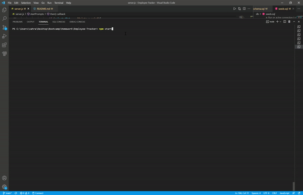

# Employee-Tracker

   

## General Information
 
* [Walkthrough Video](https://drive.google.com/file/d/1qAEB6T2h2jhiww_32ZHeqQ_9pJSUJ2Jr/view?usp=sharing)
* [GitHub repository of Employee Tracker](https://github.com/ZahraMertens/Employee-Tracker.git)

## Table of Contents
1. [General Information](#general-information)
2. [Task Description](#task-description)
3. [Installation Instructions](#installation-instructions)
5. [Technologies Used](#technologies-used)
6. [User Story](#user-story)
7. [Actual Behaviour](#actual-behaviour)
8. [Bonus](#bonus)
9. [Mock-Up](#mock-up)
10. [Credits](#credits)

## Task Description

The Application "Employee Tracker" is an interface Contnt Management System to interact with a database in order to view, add, delete and update the employees, the companies departments and the roles of the employees. The application makes it easier for non-developers to view and interact with the information stored in the database. he application is used with the command line and powered by Node.js, npm inquirer and MySql.

## Installation Instructions

* 1️⃣ First the user must clone the [GitHub Repo](https://github.com/ZahraMertens/Employee-Tracker.git) on its computer.

* 2️⃣ Open the repository on your device with VS Code (or any other program)

* 3️⃣ Open the command line at the folder location OR the integrated terminal 

* 4️⃣ First, you MUST install the npm packages by running "npm install" in the terminal

* 5️⃣ You also have to install MySql and create an account in order to be able to interact with the database

   * You then need to login to mysql on the command line and run SOURCE schema.sql and SOURCE seeds.sql to initialize the database

* 6️⃣ To run the application on your local device the user must run "npm start" in the terminal and will then be prompted with the menu to be able to select from the  listed options 

## Technologies Used

* JavaScript

* Node.JS

* Npm packages: inquirer, mysql2 & dotenv

## User Story

AS A business owner I WANT to be able to view and manage the departments, roles, and employees in my company SO THAT I can organize and plan my business

## Actual Behaviour

* WHEN I start the application THEN I am presented with the following options: view all departments, view all roles, view all employees, add a department, add a role, add an employee, and update an employee role

* WHEN I choose to view all departments THEN I am presented with a formatted table showing department names and department ids

* WHEN I choose to view all roles THEN I am presented with the job title, role id, the department that role belongs to, and the salary for that role

* WHEN I choose to view all employees THEN I am presented with a formatted table showing employee data, including employee ids, first names, last names, job titles departments, salaries, and managers that the employees report to

* WHEN I choose to add a department THEN I am prompted to enter the name of the department and that department is added to the database

* WHEN I choose to add a role THEN I am prompted to enter the name, salary, and department for the role and that role is added to the database

* WHEN I choose to add an employee THEN I am prompted to enter the employee’s first name, last name, role, and manager, and that employee is added to the database

* WHEN I choose to update an employee role THEN I am prompted to select an employee to update and their new role and this information is updated in the database

## Bonus

* 🏆 WHEN I select 'view employees by manager" I am able to select an employee by name and THEN select a new manager for the selecte  employee

* WHEN I select 'View employees by department' in the menu THEN I can select a department and will see a table with all employees in this department

* WHEN I select 'View the budget of the department' I can select a department and will se a abel with the sum of all salaries of roles assigned to this department

* WHEN I select 'Update an employees manager' I can select an employee and select the manager for this employee

* WHEN I select any of the "delete" options the I can delete an employee, a role or department from the database

## Mock-Up

🎥 The GIF shows the command line application and the functionality:

## Credits

* https://ezgif.com/crop/ezgif-3-e35ddab000ce.gif
* https://www.geeksforgeeks.org/check-if-an-array-is-empty-or-not-in-javascript/
* https://stackoverflow.com/questions/57321266/how-to-test-inquirer-validation
* https://developer.mozilla.org/en-US/docs/Web/JavaScript/Reference/Global_Objects/Promise/catch
* https://www.w3schools.com/sql/sql_intro.asp
* https://dev.mysql.com/doc/

© 2021 Zahra Mertens, Employee-Tracker